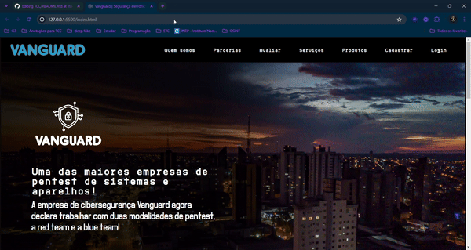

# Projeto TCC
<p align="center">
 
</p>

Esse projeto tem como objetivo apresentar o último trabalho do curso técnico em informatica para internet.
## Autores

- [@Gabriel Morozini](https://www.github.com/G3programmer)
- [@Victor Alexandre](https://www.github.com/victoralexand)


## Referência

 - [Intelbras](https://https://www.intelbras.com/pt-br/)

 - [Criador de logo](https://www.tailorbrands.com/pt-br/logo-maker)
 
 - [Photoshop](https://www.photopea.com/)
## Utilização do banco de dados

#### Para a utilização do banco de dados e do php, certifique-se de utilizar o mysql e o servidor apache do xampp, crie uma pasta no seguinte caminho se estiver usando windows

```http
  Disco que armazena o xampp / xampp / htdocs / a sua pasta criada
```

#### Se estiver usando linux, tente
```http
  opt / lampp / htdocs / a sua pasta criada
```


## Demonstração da página inicial
<p align="center">
 
</p>

